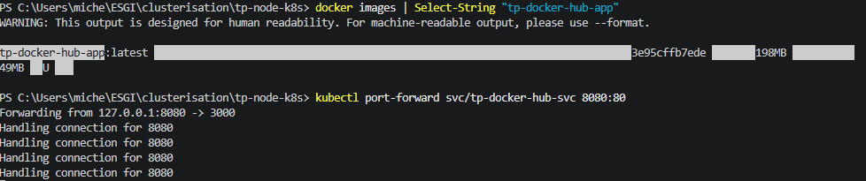
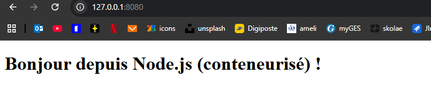
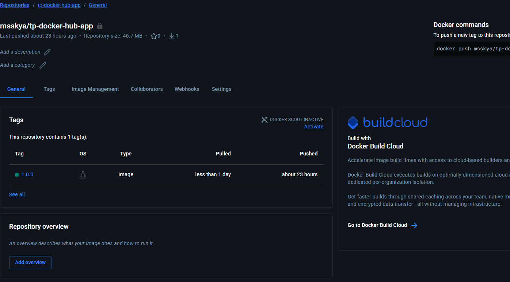
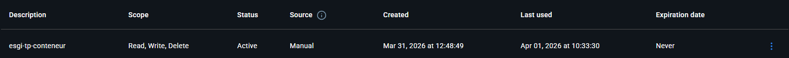
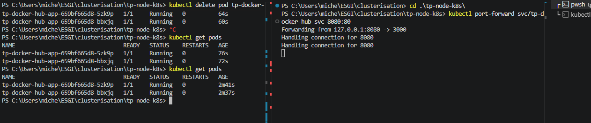

# Connexion avec le Forwarding

Apres avoir réalisé le forwarding, je me suis connecté au site et dans la console je  vois bien que je me suis connecté cf images suivantes :






# Optimisations du Dockerfile

3 optimisations du Dockerfile :

On utilise la construction en plusieurs étapes pour que l'image finale soit allégée (installation des dépendances et récupération des fichiers strictement nécessaire) :

 - Plusieurs étapes "deps", "runner"
 - Image légère : `node:20-alpine`
 - Copie des fichiers uniquement nécessaire
 `COPY --from=deps /app/node_modules ./node_modules
COPY server.js ./server.js
COPY public ./public
COPY package*.json ./`


# imagePullSecrets

`imagePullSecrets` permet à Kubernetes de s’authentifier auprès d’un registry privé (j'ai utilisé DockerHUb personnel avec mon registry privé) pour pouvoir télécharger une image.



Il faut fournir un secret `secret` (de nom regcred) que kubernetess va pouvoir utiliser pour se connecter.

1 - Création du token dans DockerHub :


2 - Configuration du `deployment.yaml` :

`imagePullSecrets:
        - name: regcred`

3 - Utilisation de ce token pour crééer le `regcred` avec la commande suivante :
``` 
kubectl create secret docker-registry regcred \
  --docker-server=https://index.docker.io/v1/ \
  --docker-username=<docker-hub-user> \
  --docker-password=<token> \                   # Mon token de dockerHub
  --docker-email=<email>
``` 

J'ai bien les deux réplicats au final : 

