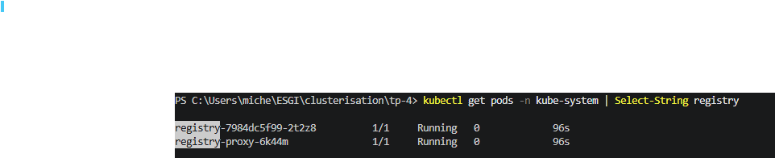
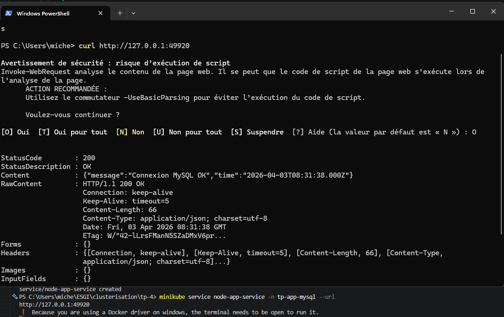
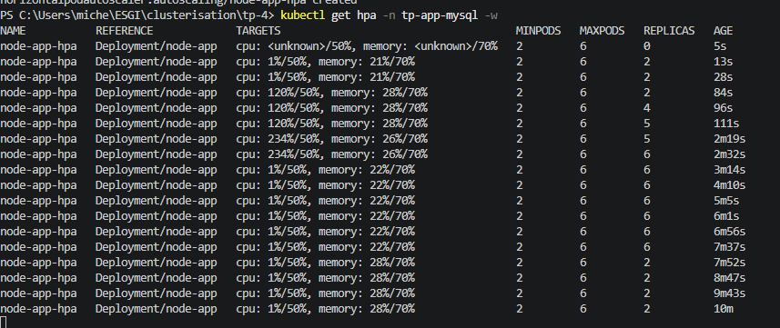
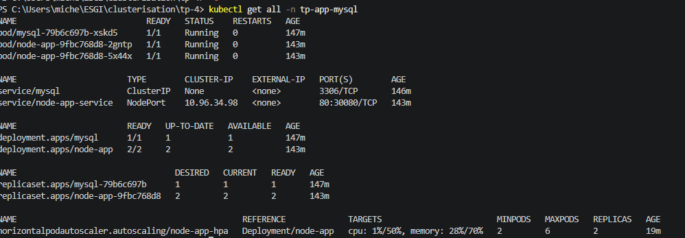

# Création des registry




# Test de l'application 




# Partie 9 - Ingress

C'est dans l'ingress que je dois ajouter des path pour router correctement vers `/api` et `/admin`
``` yml
paths:
          - path: /api
            pathType: Prefix
            backend:
              service:
                name: api-service
                port:
                  number: 80
          - path: /admin
            pathType: Prefix
            backend:
              service:
                name: admin-service
                port:
                  number: 80

```
Et apres on a un secret que l'on doit généré avec le `tls.key`et `tls.cert` pour être en HTTPS.


# Partie 10 — HorizontalPodAutoscaler




`Quelle est la différence entre un HPA et un **VPA** (Vertical Pod Autoscaler) ?`

- Le HPA augmene ou diminue le nombre de pods
- le VPA joue au niveau des ressources des pods (CPU/mémoire)


`Pourquoi le scale down est-il volontairement plus lent que le scale up ?`

- Vu qu'il y avait plein de pods pour supporter la charge (`Scale up`), il ne faut pas tout supprimer d'un coup pour éviter des coupures.
  Donc le `Scale down` est plus lent 


# Partie 11 - Vérification et observation


Lister les ressources du namespace 



